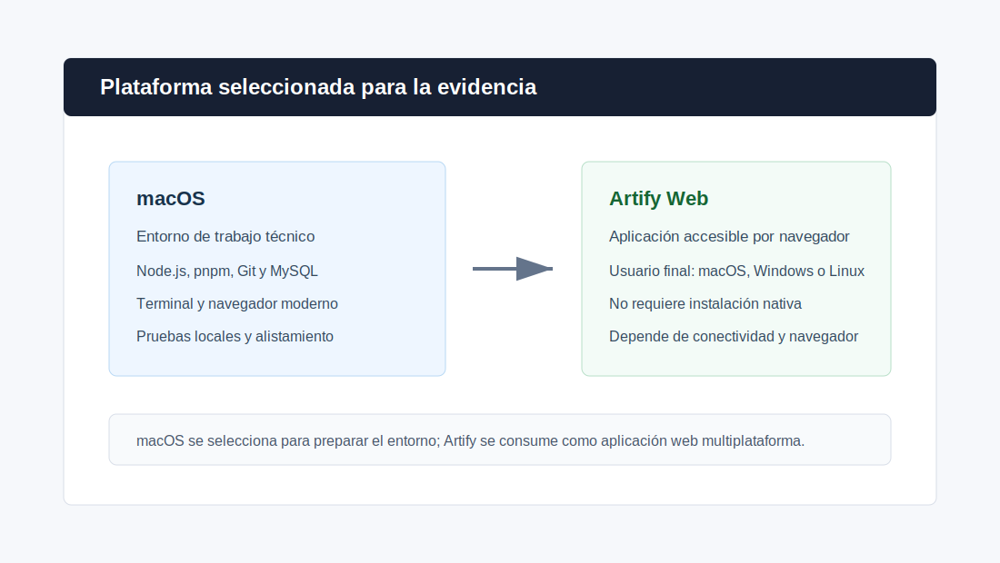
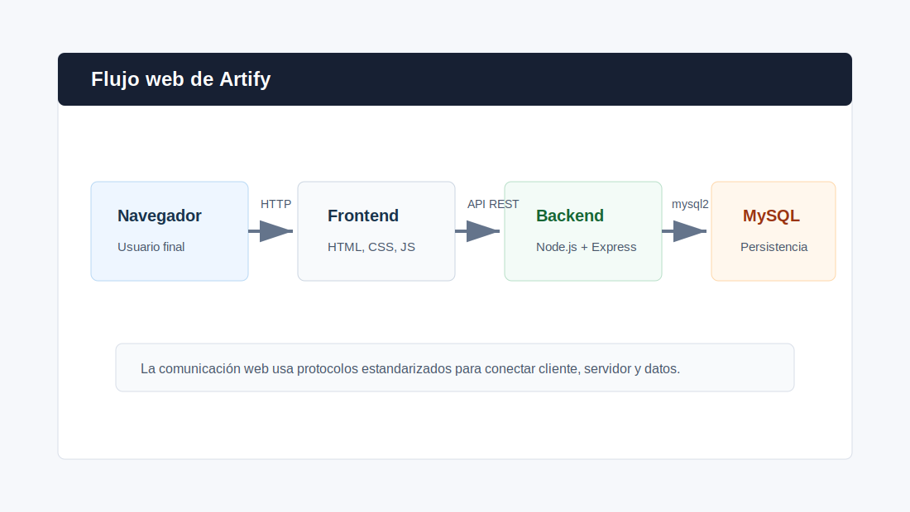
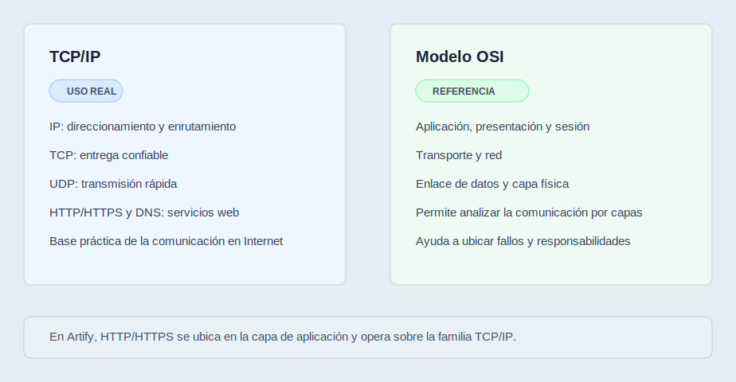
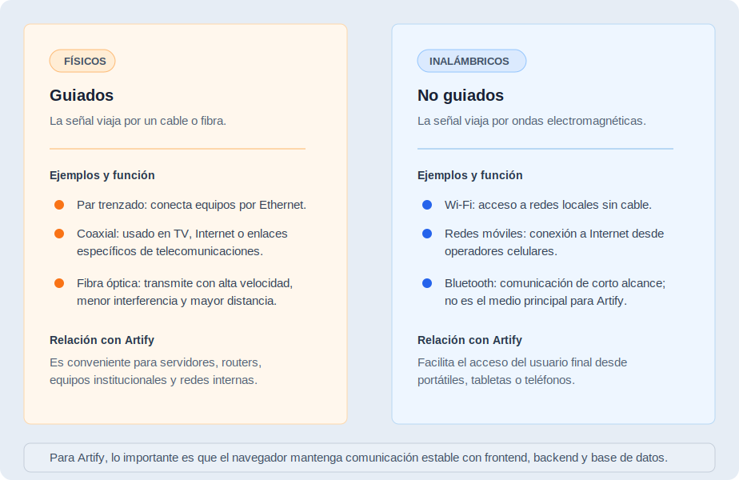

# Evidencia GA10-220501097-AA1-EV01 - Conceptos y Principios de Hardware e Instalación de Software

> **Proyecto:** Artify - Editor de Imágenes Web
> **Programa:** Análisis y Desarrollo de Software - SENA
> **Evidencia:** GA10-220501097-AA1-EV01
> **Autor:** Iván Darío Madrid Daza
> **Fecha:** Mayo 2026

---

## 1. Introducción

En este documento presento un artefacto académico-técnico relacionado con la evidencia de conocimiento GA10-220501097-AA1-EV01: conceptos y principios de hardware e instalación de software. El enfoque principal se centra en conceptos básicos de redes, networking, medios de transmisión, familias de protocolos y alistamiento de infraestructura tecnológica.

Aunque Artify es una aplicación web que puede ser usada desde diferentes sistemas operativos mediante un navegador moderno, para esta evidencia selecciono macOS como sistema operativo del entorno de trabajo, desarrollo y alistamiento. Esta selección permite explicar la preparación del ambiente donde se instala el software requerido, se ejecutan servicios locales, se prueba la conectividad y se valida el funcionamiento del proyecto.

---

## 2. Selección de la Plataforma

La plataforma seleccionada para el entorno de trabajo es macOS. Esta elección se realiza porque es el sistema operativo que utilizo para desarrollar, probar y documentar Artify durante el proceso de formación.

Desde macOS puedo preparar el entorno local necesario para el proyecto, incluyendo herramientas de desarrollo, gestor de paquetes, base de datos, navegador, terminal y control de versiones. En este contexto, macOS no se define como requisito obligatorio para el usuario final, sino como plataforma de alistamiento y trabajo técnico.

La plataforma seleccionada se compone de:

| Elemento | Selección |
| --- | --- |
| Sistema operativo | macOS |
| Aplicación evaluada | Artify |
| Tipo de aplicación | Aplicación web |
| Entorno de ejecución del usuario | Navegador web moderno |
| Entorno de trabajo técnico | macOS con herramientas de desarrollo |
| Backend | Node.js + Express |
| Base de datos | MySQL |
| Control de versiones | Git y GitHub |

---

## 3. Características del Sistema Operativo Seleccionado

macOS es un sistema operativo adecuado para el entorno de trabajo de Artify porque ofrece estabilidad, compatibilidad con herramientas de desarrollo web y una terminal integrada que facilita la instalación y ejecución de software.

Para esta evidencia, las características relevantes de macOS son:

- Permite instalar y ejecutar herramientas de desarrollo como Node.js, pnpm, Git y MySQL.
- Incluye una terminal que facilita la ejecución de comandos, pruebas y scripts.
- Soporta navegadores modernos para probar aplicaciones web.
- Permite trabajar con redes locales, puertos, servicios y conexiones HTTP.
- Ofrece una base estable para preparar entornos de desarrollo y pruebas.
- Facilita la integración con editores de código, sistemas de control de versiones y herramientas de productividad.

En el caso de Artify, macOS se usa para preparar el backend, servir el frontend, conectarse a la base de datos y verificar que la aplicación responda correctamente desde el navegador.

---

## 4. Relación de Artify con el Entorno Web

Artify está diseñado como una aplicación web. Esto significa que el usuario final no necesita instalar Artify como un programa nativo de macOS, Windows o Linux. El acceso se realiza desde un navegador web moderno, siempre que exista conexión con el servidor donde se ejecuta la aplicación.

Esta característica permite separar dos conceptos:

| Concepto | Explicación |
| --- | --- |
| Sistema operativo del usuario final | Puede ser macOS, Windows, Linux u otro sistema compatible con navegadores modernos. |
| Sistema operativo del entorno de trabajo | Para esta evidencia se selecciona macOS porque allí se prepara, ejecuta y valida el proyecto. |

Por lo tanto, Artify no depende de macOS para funcionar como aplicación web. Sin embargo, macOS sí se utiliza como plataforma seleccionada para el alistamiento del entorno técnico, instalación de software, pruebas de red local y validación del funcionamiento.

---

## 5. Organizaciones que Construyen Estándares de Redes y Networking

Las redes de computadores funcionan correctamente porque existen estándares que permiten la comunicación entre dispositivos, sistemas operativos, aplicaciones y fabricantes diferentes. Estos estándares definen reglas comunes para transmisión de datos, direccionamiento, seguridad, conectividad, interoperabilidad y funcionamiento de servicios.

Algunas organizaciones importantes en redes y networking son:

| Organización | Aporte principal |
| --- | --- |
| IEEE | Define estándares para redes físicas y de enlace, como Ethernet y Wi-Fi. |
| IETF | Desarrolla estándares de Internet, incluyendo protocolos como IP, TCP, UDP, HTTP y DNS mediante documentos RFC. |
| ISO | Propone modelos y estándares internacionales, como el modelo de referencia OSI. |
| ITU-T | Trabaja en estándares de telecomunicaciones y transmisión de datos. |
| W3C | Define estándares para la Web, como HTML, CSS y recomendaciones relacionadas con accesibilidad e interoperabilidad web. |
| ICANN | Coordina elementos de nombres de dominio y direcciones en Internet. |

Estas organizaciones permiten que una aplicación web como Artify pueda ejecutarse sobre tecnologías estandarizadas. Por ejemplo, el navegador interpreta HTML, CSS y JavaScript, mientras que la comunicación con el backend se realiza mediante protocolos de red ampliamente aceptados.

---

## 6. Familias de Protocolos para Transmisión y Recepción de Datos

En redes y networking, los protocolos permiten que los datos viajen desde un origen hasta un destino siguiendo reglas conocidas. Para esta evidencia se pueden distinguir dos grandes familias relacionadas con transmisión y recepción de datos.

### 6.1 Familia TCP/IP

La familia TCP/IP es la base principal de Internet y de muchas redes actuales. Permite direccionar dispositivos, dividir datos en paquetes, transportarlos y entregarlos a las aplicaciones correspondientes.

Algunos protocolos de esta familia son:

| Protocolo | Función |
| --- | --- |
| IP | Permite direccionar y enrutar paquetes entre redes. |
| TCP | Ofrece comunicación confiable, orientada a conexión y con control de entrega. |
| UDP | Permite comunicación rápida, sin conexión y con menor sobrecarga. |
| HTTP/HTTPS | Permite la comunicación entre navegadores y servidores web. |
| DNS | Traduce nombres de dominio a direcciones IP. |

En Artify, esta familia de protocolos se relaciona con el acceso desde el navegador al frontend y con las peticiones HTTP que el frontend realiza al backend.

### 6.2 Familia OSI

El modelo OSI no es una pila de protocolos usada de forma directa como TCP/IP, pero sí funciona como una referencia conceptual para comprender cómo se organiza la comunicación en redes. Divide el proceso en capas, desde la transmisión física de señales hasta la interacción con aplicaciones.

Las capas del modelo OSI son:

| Capa | Descripción |
| --- | --- |
| 1. Física | Transmite bits por medios físicos o inalámbricos. |
| 2. Enlace de datos | Organiza tramas y controla acceso al medio. |
| 3. Red | Gestiona direccionamiento y enrutamiento. |
| 4. Transporte | Controla la entrega de datos entre origen y destino. |
| 5. Sesión | Administra sesiones de comunicación. |
| 6. Presentación | Define representación, codificación o cifrado de datos. |
| 7. Aplicación | Permite la interacción con servicios de red y aplicaciones. |

Para Artify, este modelo ayuda a comprender que la aplicación web funciona sobre varias capas: desde el medio físico de conexión hasta el protocolo HTTP que usa el navegador.

---

## 7. Medios de Transmisión Guiados y no Guiados

Los medios de transmisión son los canales por los cuales viajan los datos dentro de una red. Se clasifican principalmente en medios guiados y medios no guiados.

### 7.1 Medios guiados

Los medios guiados utilizan un elemento físico para transportar la señal. Son comunes en redes cableadas y suelen ofrecer estabilidad, velocidad y menor interferencia.

Ejemplos:

| Medio guiado | Característica |
| --- | --- |
| Cable de par trenzado | Usado en redes Ethernet; común en hogares, oficinas e instituciones. |
| Cable coaxial | Utilizado en algunos sistemas de televisión, Internet y comunicaciones. |
| Fibra óptica | Transmite datos mediante pulsos de luz; ofrece alta velocidad y gran distancia. |

En un entorno institucional o empresarial, Artify podría estar disponible desde una red cableada interna usando Ethernet o fibra óptica para conectar equipos, servidores y dispositivos de red.

### 7.2 Medios no guiados

Los medios no guiados transmiten información sin cables físicos, usando ondas electromagnéticas. Son comunes en redes inalámbricas.

Ejemplos:

| Medio no guiado | Característica |
| --- | --- |
| Wi-Fi | Permite conectar dispositivos a una red local sin cables. |
| Bluetooth | Se usa para conexiones de corto alcance entre dispositivos. |
| Redes móviles | Permiten acceso a Internet mediante tecnologías celulares. |
| Microondas o satélite | Se usan en comunicaciones de mayor alcance o condiciones especiales. |

Para Artify, un usuario podría acceder desde un portátil conectado por Wi-Fi o desde una red cableada. Lo importante es que exista conectividad estable entre el navegador, el servidor web, el backend y la base de datos.

---

## 8. Relación con el Alistamiento de Infraestructura Tecnológica

En la fase de implantación, el alistamiento de infraestructura tecnológica consiste en preparar los recursos necesarios para que el sistema pueda funcionar correctamente. En el caso de Artify, este alistamiento incluye tanto software como condiciones de red.

Elementos importantes:

- Sistema operativo seleccionado para trabajo técnico: macOS.
- Instalación de herramientas como Node.js, pnpm, Git y MySQL.
- Configuración de variables de entorno para el backend.
- Verificación de puertos usados por el sistema, como el backend en `3000` y el frontend local en `8080`.
- Revisión de conectividad entre navegador, frontend, backend y base de datos.
- Uso de protocolos web como HTTP para la comunicación entre cliente y servidor.
- Validación de que el usuario final pueda acceder desde un navegador moderno.

Esta preparación permite confirmar que Artify no solo tiene código funcional, sino también un entorno técnico capaz de ejecutarlo, probarlo y mantenerlo.

---

## 9. Conclusión

Después de revisar los conceptos de plataforma, sistema operativo, estándares de red, protocolos y medios de transmisión, concluyo que Artify se apoya en principios fundamentales de infraestructura tecnológica y networking para funcionar correctamente como aplicación web.

macOS es una plataforma adecuada para el entorno de trabajo y alistamiento porque permite instalar las herramientas necesarias, ejecutar servicios locales y validar el funcionamiento del sistema. Sin embargo, Artify no queda limitado a macOS para el usuario final, ya que su acceso se realiza desde navegadores modernos en diferentes sistemas operativos.

También identifico que los estándares definidos por organizaciones como IEEE, IETF, ISO, ITU-T y W3C son esenciales para que las aplicaciones web puedan comunicarse de manera interoperable. Además, los protocolos de la familia TCP/IP y el modelo OSI permiten comprender cómo viajan los datos desde el usuario hasta los servicios que componen el sistema.

En conjunto, estos conceptos fortalecen la comprensión del alistamiento de infraestructura tecnológica necesario para llevar una aplicación web desde el desarrollo hacia un entorno preparado para pruebas, implantación y uso.

---

## 10. Referencias Básicas

- Apple. Documentación de macOS y herramientas para desarrolladores.
- IEEE. Estándares relacionados con redes Ethernet y Wi-Fi.
- IETF. Documentos RFC y estándares de Internet.
- ISO. Modelo de referencia OSI y estándares internacionales.
- ITU-T. Recomendaciones para telecomunicaciones y transmisión de datos.
- W3C. Estándares para tecnologías web como HTML, CSS y accesibilidad.
- SENA. Material de formación relacionado con infraestructura tecnológica, redes y alistamiento de sistemas.
